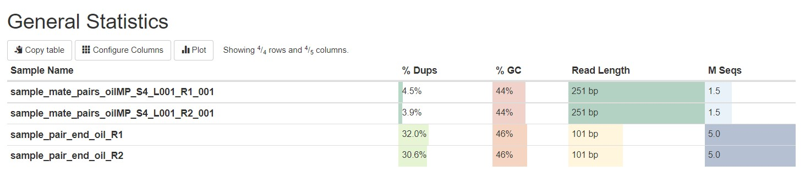
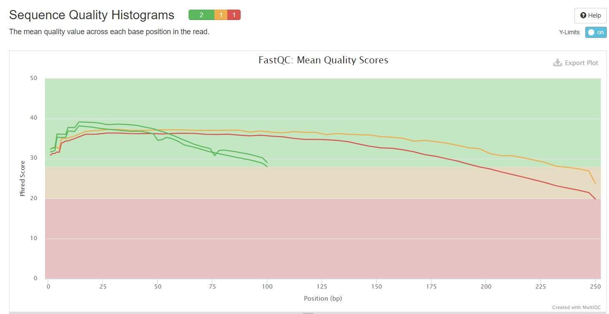
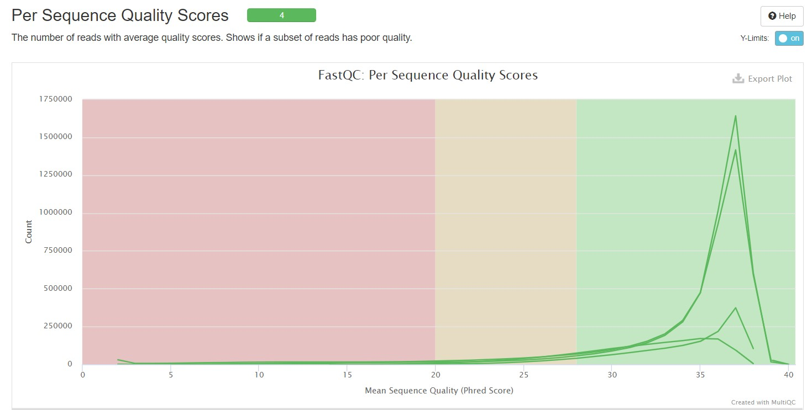
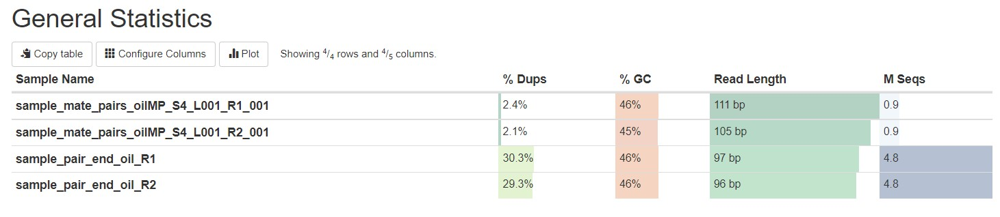
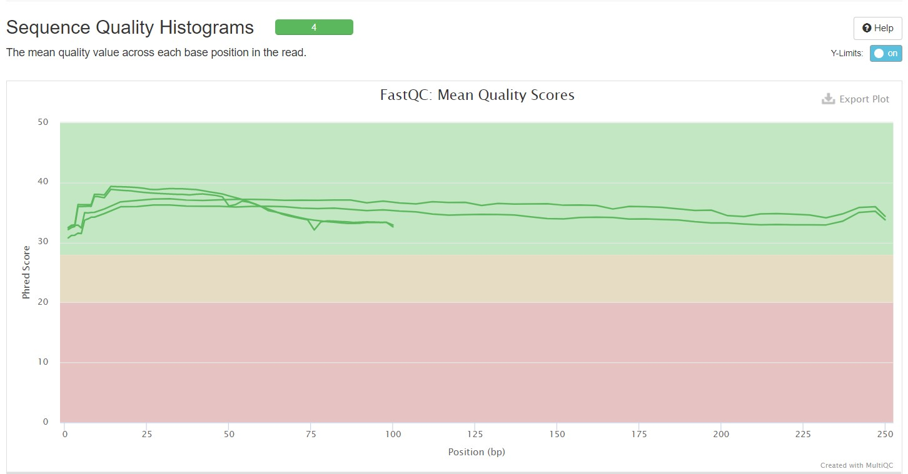
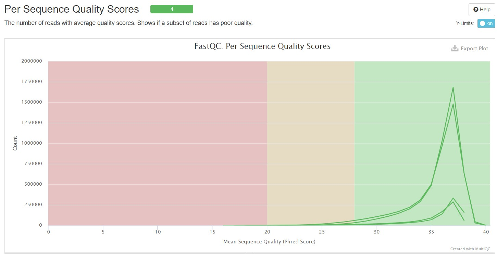

# hse22_hw1

# Майнор "Биоинформатика". 2 год, 1 семестр.
## Домашнее задание 1.

### Список команд, которые были выполнены на сервере:

Создаем директорию для ДЗ1:
```
mkdir hw1
cd hw1
```

Cоздаем символические ссылки на общие файлы:
```
ln -s /usr/share/data-minor-bioinf/assembly/oil_R1.fastq
ln -s /usr/share/data-minor-bioinf/assembly/oil_R2.fastq
ln -s /usr/share/data-minor-bioinf/assembly/oilMP_S4_L001_R1_001.fastq
ln -s /usr/share/data-minor-bioinf/assembly/oilMP_S4_L001_R2_001.fastq
```

Выбираем случайно 5 миллионов чтений типа paired-end и 1.5 миллиона чтений типа mate-pairs(код 927):
```
seqtk sample -s927 oil_R1.fastq 5000000 > sample_pair_end_oil_R1.fastq
seqtk sample -s927 oil_R2.fastq 5000000 > sample_pair_end_oil_R2.fastq
seqtk sample -s927 oilMP_S4_L001_R1_001.fastq 1500000 > sample_mate_pairs_oilMP_S4_L001_R1_001.fastq
seqtk sample -s927 oilMP_S4_L001_R2_001.fastq 1500000 > sample_mate_pairs_oilMP_S4_L001_R2_001.fastq
```

С помощью программ fastQC и multiQC оцениваем качество исходных чтений и получаем по ним общую статистику:
```
mkdir fastqc
fastqc -o fastqc sample_pair_end_oil_R1.fastq, sample_pair_end_oil_R2.fastq, sample_mate_pairs_oilMP_S4_L001_R1_001.fastq, sample_mate_pairs_oilMP_S4_L001_R2_001.fastq
mkdir multiqc
multiqc -o multiqc fastqc
```

Подрезаем чтения по качеству и удаляем адаптеры:
```
platanus_trim sample_pair_end_oil_R1.fastq, sample_pair_end_oil_R2.fastq
platanus_internal_trim sample_mate_pairs_oilMP_S4_L001_R1_001.fastq, sample_mate_pairs_oilMP_S4_L001_R2_001.fastq
```

С помощью программ fastQC и multiQC оцениваем качество подрезанных чтений и получаем по ним общую статистику:
```
mkdir fastqc_trimmed
fastqc -o fastqc_trimmed sample_pair_end_oil_R1.fastq.trimmed, sample_pair_end_oil_R2.fastq.trimmed, sample_mate_pairs_oilMP_S4_L001_R1_001.fastq.int_trimmed, sample_mate_pairs_oilMP_S4_L001_R2_001.fastq.int_trimmed
mkdir multiqc_trimmed
multiqc -o multiqc_trimmed fastqc_trimmed
```

Собираем контиги из подрезанных чтений:
```
platanus assemble –o Oil –f sample_pair_end_oil_R1.fastq.trimmed, sample_pair_end_oil_R2.fastq.trimmed 2> assemble.log
```

Cобираем скаффолды из контигов, а также из подрезанных чтений:
```
platanus scaffold –o Oil –c Oil_contig.fa -IP1 sample_pair_end_oil_R1.fastq.trimmed, sample_pair_end_oil_R2.fastq.trimmed -OP2 sample_mate_pairs_oilMP_S4_L001_R1_001.fastq.int_trimmed, sample_mate_pairs_oilMP_S4_L001_R2_001.fastq.int_trimmed 2> scaffold.log
```

Уменьшаем количетво гэпов с помощью подрезанных чтений:
```
platanus gap_close –o Oil –c Oil_scaffold.fa -IP1 sample_pair_end_oil_R1.fastq.trimmed, sample_pair_end_oil_R2.fastq.trimmed -OP2 sample_mate_pairs_oilMP_S4_L001_R1_001.fastq.int_trimmed, sample_mate_pairs_oilMP_S4_L001_R2_001.fastq.int_trimmed 2> gapclose.log
```
____

### Скриншоты и статистика из файлов multiQC:

Исходные чтения





Подрезанные чтения





____

### Ссылки на jupiter ноутбуки:

В [jupiter-ноутбуке](src/analysis_of_contigs_and_scaffolds.ipynb) содержатся
- анализ полученных контигов (общее количество контигов, их общая длина, длина самого длинного контига, N50)
- анализ полученных скаффолдов (общее кол-во скаффолдов, их общая длина, длина самого длинного скаффолда, N50)
- данные по количеству гэпов и их общей длине для самого длинного скаффолда
- анализа полученных скаффолдов после gap_close (общее кол-во скаффолдов, их общая длина, длина самого длинного скаффолда, N50)
- данные по количеству гэпов и их общей длине для самого длинного скаффолда после gap_close

____

###  Бонус
